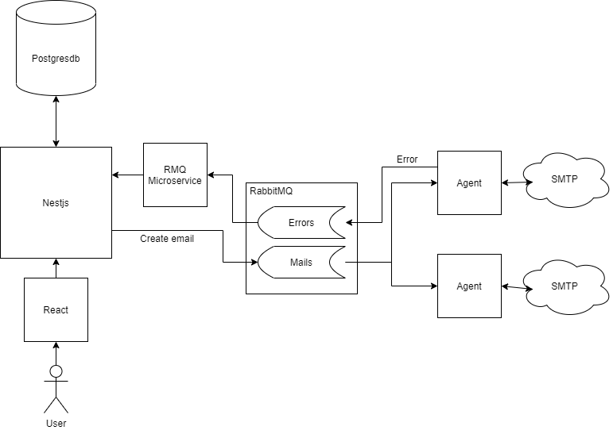

# PRIvate Spam Mailer
## Quick setup
### 1. Clone project: 
### `git clone https://github.com/Danr0/PRISM`
### 2. Move to path: 
### `cd  ./PRISM/backend`
### 3. Change secrets: 
### `nano .env`
### 4. Build: 
### ` docker-compose build`
### 5. Run: 
### ` docker-compose up`
## Agent Setup
### 1. Move to path:
### `cd  ./PRISM/agent`
### 2. Install dep:
### `yarn instal`
### 3. Change connection string:
### `nano recieve.ts`
### 4. (Turn on VPN or proxy) Run agent:
### `yarn agent`
## Ready SMTP configs
### Yandex: 
Use login/pass
### Mail.ru: 
Use login/pass
### Google.com: 
Use login/pass with option "allow less secure apps to access your account" or login/app_password with 2fa
### Mephi.ru:
Use campus login/pass
### Custom:
You can modify connection options for ur own connection  
Sometimes you need to add additional options, such as ssl version. If so, make sure to check mephi example.
## Technologies
### Back 
#### NestJs + PostgresDB + RabbitMQ
yarn, nestjs, passport, typeorm, @nestjs/microservices (RMQ)
### Agent
yarn, nodemailer, amqplib
### Front
Webpack, Babel, TypeScript, React, React Router, Redux, material-ui

## Architecture diagram

